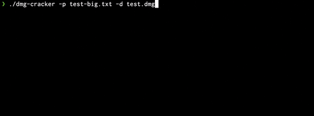

# DMG Cracker

CLI for performing dictionary attacks on encrypted Apple Disk Image files (.dmg)

While this tool offers a solution for accessing encrypted disk images,
it is important to note that it is intended for personal use only and 
should not be used for illegal purposes. The author assumes no 
responsibility for any misuse of the tool and it is the responsibility 
of the user to comply with all applicable laws and regulations.

  

## Installation
`cargo install dmg-cracker`

## Upcoming features
- investigate implementing AES decrpytion manually. Current road block being a method of extracting the key generation salt from the dmg file headers
- support for testing different permutations of a given password list
- increase test coverage

## Testing / Contributing
Any contributions or issue raising is welcomed. If you wish to contribute then:
1. fork/clone this repo
2. make changes on a branch taken from main
3. submit a pull request against main

Pull requests will be blocked from merging automatically if:
- there are failing tests
- linting rules have been violated.
